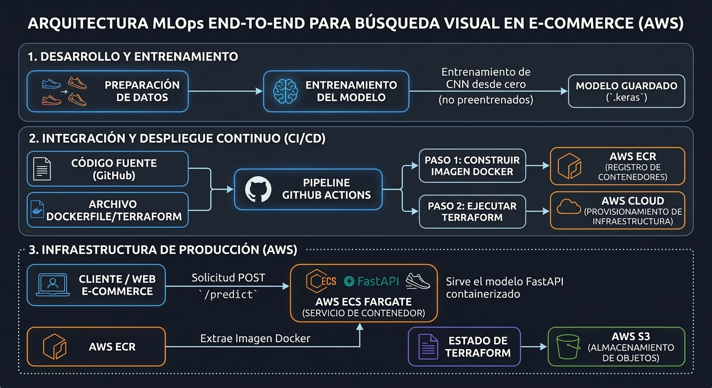

# Sneaker MLOps API

Proyecto personal para practicar el despliegue de modelos de Machine Learning en AWS utilizando herramientas habituales del ecosistema DevOps/MLOps.

La idea del proyecto es sencilla: entrenar un modelo capaz de clasificar imágenes de zapatillas y exponerlo mediante una API para realizar inferencias. Además del modelo, el objetivo principal era trabajar todo el proceso de despliegue y automatización en la nube.

## Tecnologías utilizadas

* Python
* TensorFlow
* FastAPI
* Docker
* AWS ECS Fargate
* Amazon ECR
* Terraform
* GitHub Actions

## Objetivos del proyecto

Se ha tratado de llevar un modelo que se entrenó hace un año a una idea de e-commerce real, donde se propone un modelo de búsqueda a través de visión artificial en un portal web.
